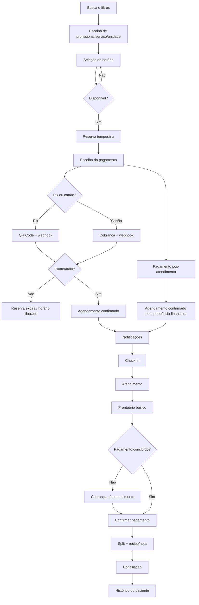

# Fluxo de Agendamento ao Financeiro (MVP)

## 1) Busca e escolha
1. Paciente pesquisa por especialidade/cidade/convênio.
2. Sistema retorna lista de profissionais com filtros (teleconsulta/presencial, datas, bairros).
3. Paciente escolhe profissional, serviço, unidade e modalidade.
4. Sistema mostra horários disponíveis (regra semanal + bloqueios + capacidade).

## 2) Pré-agendamento
1. Paciente seleciona horário.
2. Sistema valida disponibilidade em tempo real.
3. Paciente entra/cadastra-se e confirma dados.
4. Sistema cria uma reserva temporária do horário com expiração (ex.: 10–15 min).

## 3) Pré-pagamento
1. Sistema calcula valor do serviço e taxas.
2. Se houver convênio, aplica regras (ex.: “somente indicação de convênio” no MVP).
3. Paciente escolhe forma de pagamento: Pix ou cartão.
4. Alternativa: pagamento pós-atendimento, mantendo o agendamento em “confirmado” com status financeiro “pendente”.

## 4) Pagamento
1. Pix: sistema gera QR Code com validade; aguarda confirmação via webhook do gateway.
2. Cartão: sistema envia cobrança e aguarda confirmação via webhook.
3. Falha ou expiração: reserva é liberada e horário volta à agenda.
4. Pós-atendimento: cobrança pode ser gerada no final da consulta (checkout pela secretária ou profissional).

## 5) Confirmação
1. Pagamento confirmado -> agendamento muda para “confirmado”.
2. Notificações são enviadas (e-mail no MVP; SMS/WhatsApp na fase 2).
3. Evento aparece na agenda do profissional/secretária.

## 6) Atendimento
1. Secretária faz check-in do paciente.
2. Atendimento ocorre (presencial ou teleconsulta).
3. Profissional registra anotação no prontuário básico.

## 7) Financeiro
1. Split do pagamento (clínica/profissional) conforme regra definida.
2. Geração de recibo/nota fiscal quando aplicável.
3. Conciliação diária: recebidos, pendentes, estornos.

## 8) Pós-atendimento
1. Paciente acessa histórico de consultas e recibos.
2. Sistema solicita avaliação do profissional.

---

## Estados principais do agendamento
- reservada -> pendente_pagamento -> confirmada -> em_atendimento -> concluida
- cancelada (com ou sem reembolso)
 - confirmada_com_pagamento_pendente (quando pagamento é pós-atendimento)

## Observações
- A reserva expira automaticamente se o pagamento não for confirmado.
- Remarcações podem reutilizar o pagamento (crédito) ou gerar novo pagamento.

---

## Fluxo em Mermaid (alto nível)

---

## Backlog MVP (histórias por perfil)

### Clínica (admin)
- Como clínica, quero cadastrar unidades e endereços para operar multiunidade.
- Como clínica, quero cadastrar profissionais e seus vínculos com unidades.
- Como clínica, quero cadastrar serviços com duração e preço padrão.
- Como clínica, quero configurar regras de agenda (horários, bloqueios).
- Como clínica, quero configurar convênios aceitos por profissional/serviço.
- Como clínica, quero ver relatórios financeiros básicos (recebidos, pendentes, estornos).

### Profissional
- Como profissional, quero ver minha agenda diária e semanal.
- Como profissional, quero acessar o prontuário básico do paciente.
- Como profissional, quero registrar anotação da consulta.
- Como profissional, quero bloquear horários (férias, eventos).

### Secretária
- Como secretária, quero criar/editar/cancelar agendamentos.
- Como secretária, quero fazer check-in do paciente.
- Como secretária, quero registrar pagamento pós-atendimento.
- Como secretária, quero ver lista de pagamentos pendentes.

### Paciente
- Como paciente, quero buscar profissionais por especialidade/cidade/convênio.
- Como paciente, quero ver horários disponíveis e agendar consulta.
- Como paciente, quero pagar no agendamento (Pix/cartão) ou após atendimento.
- Como paciente, quero acessar meus agendamentos e histórico.
- Como paciente, quero cancelar ou remarcar consulta dentro da política.

### Sistema/Integrações
- Como sistema, quero confirmar pagamentos via webhooks do gateway.
- Como sistema, quero enviar e-mail de confirmação e lembrete.
- Como sistema, quero liberar o horário se a reserva expirar.

---

## Critérios de aceite (resumo)

### Clínica (admin)
- Unidades: criar/editar/desativar unidade; endereço obrigatório.
- Profissionais: vínculo com unidade; especialidade obrigatória; status ativo/inativo.
- Serviços: duração mínima > 0; preço obrigatório; modalidade definida.
- Regras de agenda: definir dias/horários; bloqueios não permitem agendamento.
- Convênios: marcar aceitos por profissional/serviço; exibir no perfil e filtro.
- Financeiro: relatório com total recebido, pendente e estornos por período.

### Profissional
- Agenda: visualizar dia/semana com status do agendamento.
- Prontuário: acesso apenas aos pacientes atendidos.
- Anotação: salvar notas com data e serviço; edição registrada.
- Bloqueios: criar bloqueio que impede novos agendamentos.

### Secretária
- Agendamento: criar, remarcar e cancelar respeitando política.
- Check-in: alterar status para "em_atendimento".
- Pagamento pós: registrar pagamento e emitir recibo.
- Pendências: listar pagamentos pendentes por período.

### Paciente
- Busca: filtros por especialidade, cidade e convênio funcionam.
- Agendamento: escolher horário disponível e confirmar.
- Pagamento: Pix gera QR; cartão confirma; pós-atendimento disponível.
- Histórico: lista de consultas com status e recibos.
- Cancelamento: respeitar janela de cancelamento configurada.

### Sistema/Integrações
- Webhook: atualiza status financeiro do agendamento.
- E-mail: enviado em confirmação, lembrete e cancelamento.
- Reserva: expira após tempo definido e libera horário.

---

## Épicos e sprints sugeridos (MVP)

### Épicos
1. Identidade e perfis (auth, RBAC, multi-clínica)
2. Agenda e serviços (regras, bloqueios, disponibilidade)
3. Agendamentos (fluxo paciente + gestão secretária)
4. Pagamentos (Pix/cartão, split, recibos)
5. Prontuário básico
6. Notificações (e-mail)
7. Relatórios financeiros

### Sprints (2 semanas cada)
**Sprint 1**
- Auth + RBAC + multi-clínica
- Cadastro de unidades, profissionais e serviços

**Sprint 2**
- Regras de agenda e bloqueios
- Tela de agenda para profissional/secretária

**Sprint 3**
- Fluxo de agendamento do paciente
- Estados do agendamento + expiração de reserva

**Sprint 4**
- Pagamentos Pix/cartão + webhooks
- Split + recibos

**Sprint 5**
- Prontuário básico + check-in
- Notificações e-mails + relatórios financeiros simples
